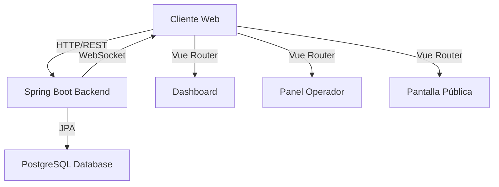

<div align="center">

# SILAS

### *Sistema Inteligente de Gestión de Turnos y Atención al Cliente*


[Características](#-características-principales) •
[Demo](#-demo) •
[Instalación](#-instalación) •
[Documentación](#-documentación-api) •
[Contribuir](#-contribuir)


</div>

---

## 📖 Sobre el Proyecto

**SILAS** (Sistema Inteligente de Líneas de Atención y Servicio) es una plataforma full-stack moderna diseñada para revolucionar la gestión de turnos en organizaciones de alta demanda. Optimiza la experiencia del cliente mediante un sistema inteligente de prioridades y seguimiento en tiempo real.

### 💡 ¿Por qué SILAS?

- ⚡ **Reducción de Tiempos**: Hasta 40% menos tiempo de espera
- 📊 **Datos en Tiempo Real**: Dashboard con analytics instantáneos
- 🎯 **Sistema de Prioridades**: VIP, Alta, Normal, Baja
- 🖥️ **Multiplataforma**: Web responsive para cualquier dispositivo
- 🔄 **Actualizaciones Live**: WebSockets para sincronización instantánea

---

## ✨ Características Principales

<table>
<tr>
<td width="50%">

### 🎫 Gestión de Turnos

- ✅ Generación automática de tickets
- ✅ Sistema de prioridades multinivel
- ✅ Cola inteligente con reordenamiento
- ✅ Notificaciones en tiempo real
- ✅ Historial completo de atención

### 📊 Dashboard Analítico

- 📈 Estadísticas en tiempo real
- 📉 Tiempos promedio de atención
- 🎯 KPIs personalizables
- 📅 Reportes diarios/semanales/mensuales
- 📊 Gráficos interactivos con Chart.js

</td>
<td width="50%">

### 👥 Panel de Operador

- 🔔 Llamado de turnos con un click
- ⏱️ Temporizador de atención
- 📝 Notas y observaciones
- 🔄 Reasignación de turnos
- 📱 Interfaz optimizada

### 🖥️ Pantalla Pública

- 📺 Visualización de turnos activos
- 🎨 Diseño personalizable
- 🔊 Audio alerts opcionales
- 📱 Responsive para TVs/tablets
- 🌈 Animaciones suaves con GSAP

</td>
</tr>
</table>

---

## 🛠️ Stack Tecnológico

<div align="center">

### Backend

[](https://www.oracle.com/java/)
[](https://spring.io/projects/spring-boot)
[](https://www.postgresql.org/)
[](https://maven.apache.org/)

**Características técnicas:**
- Spring Data JPA para ORM
- Hibernate como implementación JPA
- Spring Web para REST APIs
- Lombok para reducir boilerplate
- Validación con Bean Validation

### Frontend

[](https://vuejs.org/)
[](https://vitejs.dev/)
[](https://tailwindcss.com/)
[](https://www.chartjs.org/)

**Características técnicas:**
- Composition API de Vue 3
- Pinia para gestión de estado
- Vue Router para navegación
- GSAP para animaciones
- Font Awesome para iconos

</div>

### 🏗️ Arquitectura del Sistema



---

## 🚀 Instalación

### 📋 Prerrequisitos

Asegúrate de tener instalado:

```bash
# Verificar versiones
java -version    # >= 17
node --version   # >= 20
psql --version   # >= 15
mvn --version    # >= 3.8
```

### 📦 Instalación Rápida

#### 1️⃣ Clonar el Repositorio

```bash
git clone https://github.com/JDNG111/silas-turnos.git
cd silas-turnos
```

#### 2️⃣ Configurar Base de Datos

```bash
# Crear base de datos PostgreSQL
psql -U postgres
CREATE DATABASE silas_db;
\q
```

**Configurar credenciales** en `backend-silas/src/main/resources/application.properties`:

```properties
# Database Configuration
spring.datasource.url=jdbc:postgresql://localhost:5432/silas_db
spring.datasource.username=tu_usuario
spring.datasource.password=tu_contraseña

# JPA Configuration
spring.jpa.hibernate.ddl-auto=update
spring.jpa.show-sql=true
spring.jpa.properties.hibernate.format_sql=true

# Server Configuration
server.port=8080
```

#### 3️⃣ Backend Setup

```bash
cd backend-silas

# Instalar dependencias y compilar
mvn clean install

# Ejecutar aplicación (puerto 8080)
mvn spring-boot:run
```

<details>
<summary>🔧 Ver configuración avanzada de Spring Boot</summary>

```properties
# Application Name
spring.application.name=SILAS

# Logging Configuration
logging.level.com.silas=DEBUG
logging.level.org.springframework.web=INFO
logging.level.org.hibernate.SQL=DEBUG

# Jackson Configuration
spring.jackson.serialization.write-dates-as-timestamps=false
spring.jackson.time-zone=America/Bogota

# CORS Configuration
cors.allowed-origins=http://localhost:5173
cors.allowed-methods=GET,POST,PUT,DELETE,OPTIONS
```

</details>

#### 4️⃣ Frontend Setup

```bash
# En otra terminal
cd frontend-silas

# Instalar dependencias
npm install

# Configurar URL del backend (si es diferente)
# Editar src/config/api.js

# Ejecutar en modo desarrollo (puerto 5173)
npm run dev
```

#### 5️⃣ ¡Listo! 🎉

- **Frontend**: `http://localhost:5173`
- **Backend API**: `http://localhost:8080/api`
- **Swagger UI**: `http://localhost:8080/swagger-ui.html` *(si está habilitado)*

---

## 📁 Estructura del Proyecto

```
silas-turnos/
│
├── backend-silas/                    # 🔧 Spring Boot Application
│   ├── src/
│   │   ├── main/
│   │   │   ├── java/com/silas/
│   │   │   │   ├── controller/      # 🎮 REST Controllers
│   │   │   │   │   ├── ServiceController.java
│   │   │   │   │   ├── TurnController.java
│   │   │   │   │   └── DashboardController.java
│   │   │   │   │
│   │   │   │   ├── service/         # 💼 Business Logic
│   │   │   │   │   ├── ServiceService.java
│   │   │   │   │   ├── TurnService.java
│   │   │   │   │   └── DashboardService.java
│   │   │   │   │
│   │   │   │   ├── repository/      # 🗄️ JPA Repositories
│   │   │   │   │   ├── ServiceRepository.java
│   │   │   │   │   └── TurnRepository.java
│   │   │   │   │
│   │   │   │   ├── model/           # 📦 Entity Models
│   │   │   │   │   ├── Service.java
│   │   │   │   │   ├── Turn.java
│   │   │   │   │   └── Priority.java
│   │   │   │   │
│   │   │   │   ├── dto/             # 📋 DTOs
│   │   │   │   │   ├── TurnRequest.java
│   │   │   │   │   ├── TurnResponse.java
│   │   │   │   │   └── DashboardStats.java
│   │   │   │   │
│   │   │   │   ├── config/          # ⚙️ Configuration
│   │   │   │   │   ├── CorsConfig.java
│   │   │   │   │   └── SecurityConfig.java
│   │   │   │   │
│   │   │   │   └── exception/       # ⚠️ Exception Handling
│   │   │   │       └── GlobalExceptionHandler.java
│   │   │   │
│   │   │   └── resources/
│   │   │       ├── application.properties
│   │   │       └── data.sql         # Datos iniciales
│   │   │
│   │   └── test/
│   │       └── java/com/silas/
│   │           └── TurnServiceTest.java
│   │
│   └── pom.xml
│
└── frontend-silas/                   # 🎨 Vue.js Application
    ├── src/
    │   ├── components/               # 🧩 Vue Components
    │   │   ├── TurnCard.vue
    │   │   ├── ServiceSelector.vue
    │   │   ├── StatsWidget.vue
    │   │   └── TurnList.vue
    │   │
    │   ├── views/                    # 📄 Page Views
    │   │   ├── Dashboard.vue
    │   │   ├── OperatorPanel.vue
    │   │   ├── PublicScreen.vue
    │   │   └── GenerateTurn.vue
    │   │
    │   ├── router/                   # 🧭 Vue Router
    │   │   └── index.js
    │   │
    │   ├── stores/                   # 🗂️ Pinia Stores
    │   │   ├── turnStore.js
    │   │   └── serviceStore.js
    │   │
    │   ├── services/                 # 🔌 API Services
    │   │   ├── api.js
    │   │   ├── turnService.js
    │   │   └── dashboardService.js
    │   │
    │   ├── assets/                   # 🎨 Styles & Images
    │   │   ├── styles/
    │   │   │   └── main.css
    │   │   └── images/
    │   │
    │   ├── utils/                    # 🛠️ Utilities
    │   │   ├── dateFormatter.js
    │   │   └── constants.js
    │   │
    │   ├── App.vue
    │   └── main.js
    │
    ├── public/
    │   └── favicon.ico
    │
    ├── index.html
    ├── package.json
    ├── vite.config.js
    ├── tailwind.config.js
    └── postcss.config.js
```

---

## 📚 Documentación API

### 🎯 Endpoints Principales

#### 📋 Servicios

| Método | Endpoint | Descripción | Body |
|--------|----------|-------------|------|
| `GET` | `/api/services` | Listar todos los servicios | - |
| `POST` | `/api/services` | Crear nuevo servicio | `{name, description, estimatedTime}` |
| `GET` | `/api/services/{id}` | Obtener servicio por ID | - |
| `PUT` | `/api/services/{id}` | Actualizar servicio | `{name, description, estimatedTime}` |
| `DELETE` | `/api/services/{id}` | Eliminar servicio | - |

#### 🎫 Turnos

| Método | Endpoint | Descripción | Body |
|--------|----------|-------------|------|
| `GET` | `/api/turns` | Listar todos los turnos | Query: `?status=WAITING&date=2024-01-15` |
| `GET` | `/api/turns/active` | Obtener turnos activos | - |
| `POST` | `/api/turns` | Crear nuevo turno | `{serviceId, priority, customerName}` |
| `GET` | `/api/turns/{id}` | Obtener turno por ID | - |
| `PUT` | `/api/turns/{id}/call` | Llamar turno | - |
| `PUT` | `/api/turns/{id}/start` | Iniciar atención | `{operatorId}` |
| `PUT` | `/api/turns/{id}/complete` | Completar atención | `{notes}` |
| `PUT` | `/api/turns/{id}/cancel` | Cancelar turno | `{reason}` |
| `DELETE` | `/api/turns/{id}` | Eliminar turno | - |

#### 📊 Dashboard

| Método | Endpoint | Descripción | Query Params |
|--------|----------|-------------|--------------|
| `GET` | `/api/dashboard/stats` | Estadísticas generales | `?date=2024-01-15` |
| `GET` | `/api/dashboard/chart-data` | Datos para gráficos | `?period=week` |
| `GET` | `/api/dashboard/service-performance` | Rendimiento por servicio | - |

### 📝 Ejemplos de Uso

#### Crear un Turno

```bash
curl -X POST http://localhost:8080/api/turns \
  -H "Content-Type: application/json" \
  -d '{
    "serviceId": 1,
    "priority": "NORMAL",
    "customerName": "Juan Pérez"
  }'
```

**Respuesta:**

```json
{
  "id": 42,
  "ticketNumber": "A042",
  "serviceId": 1,
  "serviceName": "Atención General",
  "priority": "NORMAL",
  "status": "WAITING",
  "customerName": "Juan Pérez",
  "createdAt": "2024-01-15T10:30:00",
  "estimatedWaitTime": 15
}
```

#### Obtener Estadísticas del Dashboard

```bash
curl http://localhost:8080/api/dashboard/stats?date=2024-01-15
```

**Respuesta:**

```json
{
  "totalTurns": 145,
  "turnsCompleted": 120,
  "turnsInProgress": 8,
  "turnsWaiting": 17,
  "averageWaitTime": 12.5,
  "averageServiceTime": 8.3,
  "peakHour": "14:00",
  "serviceDistribution": {
    "Atención General": 60,
    "Pagos": 45,
    "Información": 40
  }
}
```

### 🔄 Estados de Turnos

```
WAITING → CALLED → IN_PROGRESS → COMPLETED
   ↓         ↓           ↓
CANCELLED CANCELLED CANCELLED
```

| Estado | Descripción |
|--------|-------------|
| `WAITING` | Turno en espera en la cola |
| `CALLED` | Turno llamado, esperando al cliente |
| `IN_PROGRESS` | Cliente siendo atendido |
| `COMPLETED` | Atención finalizada exitosamente |
| `CANCELLED` | Turno cancelado |

### 🎨 Prioridades

| Prioridad | Valor | Descripción | Color |
|-----------|-------|-------------|-------|
| `VIP` | 1 | Atención prioritaria máxima | 🟣 Morado |
| `ALTA` | 2 | Prioridad alta | 🔴 Rojo |
| `NORMAL` | 3 | Prioridad estándar | 🟡 Amarillo |
| `BAJA` | 4 | Prioridad baja | 🟢 Verde |

---

## 🎨 Capturas de Pantalla

<div align="center">

### Dashboard Principal


### Panel de Operador


### Pantalla Pública


### Generación de Turnos


</div>

---

## 🧪 Testing

### Backend Tests

```bash
cd backend-silas

# Ejecutar todos los tests
mvn test

# Ejecutar con coverage
mvn test jacoco:report

# Ver reporte de coverage
open target/site/jacoco/index.html
```

### Frontend Tests

```bash
cd frontend-silas

# Unit tests con Vitest
npm run test

# E2E tests con Cypress
npm run test:e2e

# Coverage
npm run test:coverage
```

---

## 🚀 Despliegue

### Docker (Recomendado)

```bash
# Build images
docker-compose build

# Start services
docker-compose up -d

# View logs
docker-compose logs -f
```

<details>
<summary>Ver docker-compose.yml</summary>

```yaml
version: '3.8'

services:
  postgres:
    image: postgres:15
    environment:
      POSTGRES_DB: silas_db
      POSTGRES_USER: silas
      POSTGRES_PASSWORD: silas123
    ports:
      - "5432:5432"
    volumes:
      - postgres_data:/var/lib/postgresql/data

  backend:
    build: ./backend-silas
    ports:
      - "8080:8080"
    depends_on:
      - postgres
    environment:
      SPRING_DATASOURCE_URL: jdbc:postgresql://postgres:5432/silas_db
      SPRING_DATASOURCE_USERNAME: silas
      SPRING_DATASOURCE_PASSWORD: silas123

  frontend:
    build: ./frontend-silas
    ports:
      - "80:80"
    depends_on:
      - backend

volumes:
  postgres_data:
```

</details>

### Manual Deployment

#### Backend (JAR)

```bash
cd backend-silas
mvn clean package
java -jar target/silas-backend-1.0.0.jar
```

#### Frontend (Build)

```bash
cd frontend-silas
npm run build
# Copiar dist/ a tu servidor web
```

---

## 🤝 Contribuir

¡Las contribuciones son bienvenidas! Sigue estos pasos:

1. Fork el proyecto
2. Crea tu Feature Branch (`git checkout -b feature/AmazingFeature`)
3. Commit tus cambios (`git commit -m 'Add: Amazing feature'`)
4. Push al Branch (`git push origin feature/AmazingFeature`)
5. Abre un Pull Request

### 📏 Guía de Estilo

- **Java**: Seguir convenciones de Spring Boot
- **Vue**: Composition API con `<script setup>`
- **Commits**: [Conventional Commits](https://www.conventionalcommits.org/)

---

## 📄 Licencia

Distribuido bajo la Licencia MIT. Ver [`LICENSE`](LICENSE) para más información.

```
MIT License - Copyright (c) 2024
```

---

## 👨‍💻 Autor

<div align="center">

**JDNG111**

[](https://github.com/JDNG111)
[](mailto:NAVARROESTUDIANTE1010@GMAIL.COM)

</div>

---

## 🙏 Agradecimientos

- [Spring Boot](https://spring.io/projects/spring-boot) - Framework backend robusto
- [Vue.js](https://vuejs.org/) - Framework frontend progresivo
- [Tailwind CSS](https://tailwindcss.com/) - Framework CSS utility-first
- [PostgreSQL](https://www.postgresql.org/) - Base de datos confiable
- [Chart.js](https://www.chartjs.org/) - Librería de gráficos
- [GSAP](https://greensock.com/gsap/) - Animaciones profesionales
- [Font Awesome](https://fontawesome.com/) - Iconos increíbles
- [Amigos] - Juan Diego Gonzalez, Santiago Gonzalez, Sebastian Castañeda

---

## 📊 Estadísticas


---

<div align="center">

### ⭐ Si este proyecto te fue útil, considera darle una estrella ⭐

**SILAS** - *Transformando la experiencia de atención al cliente*

[⬆ Volver arriba](#-silas)

</div>
